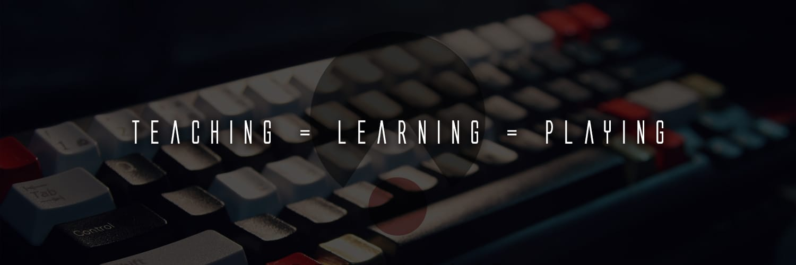

# Cursus Développeur Web OpenCamp

 

<h2 align="center">
  :warning: :construction: Work in progress … :construction: :warning:
</h2>

L'OpenCamp est un projet de formation Développeur Web open source, avec une philosophie un peu différente d'un parcours classique.
Ici nous n'allons pas raisonner en terme de temps de formation alloué, en terme de passage de titre professionnel, ou tout autre diplôme à l'issue.

Notre objectif ici est de se focaliser sur les compétences requises pour tout développeur junior digne de ce nom.

Les technologies évoluent tellement vite et les parcours de formations tellement lentement …

Ce projet est la cristalisation de plusieurs années d'expérience dans le monde de la formation professionnelle du développement web, avec tout ce que cela implique en terme de réussites et d'échecs.

Le cursus présenté ici est basé sur la [Developer Roadmap 2020](https://github.com/kamranahmedse/developer-roadmap) pilotée par la communauté qui totalise plus de 94k de stars sur Github, ce qui est assez solide pour qu'on puisse réfléchir à un parcours de formation qui repose sur cet outil et soit cohérent avec les besoins de l'industrie.

Pour commencer, nous allons déjà nous attaquer au mythe du "développeur fullstack" qui, au regard des compétences requises pour chaque métier que sont le développeur frontend, le développeur backend, ainsi que le devops nous paraît extrêmement difficile à atteindre pour le commun des mortels.

Par conséquent, nous allons proposer dans un premier temps, deux parcours bien distincts : [frontend](/frontend) et [backend](/backend).

Étant donné que ce projet est entièrement open source, toutes les participations de quelque nature que ce soit sont plus que les bienvenues.
Il n'est pas nécessaire d'être particulièrement compétent pour participer à ce projet, nous avons besoin de toute l'aide disponible, que ce soit de la relecture, correction, partage de ressources, d'idées etc …

Ne pas hésiter à proposer vos idées dans [la boîte à idées](boite-a-idees.md).

## Nous rejoindre

* [Discord](https://discord.gg/R7kPn7j)
* [Twitter](https://twitter.com/OpenCampDotDev)
